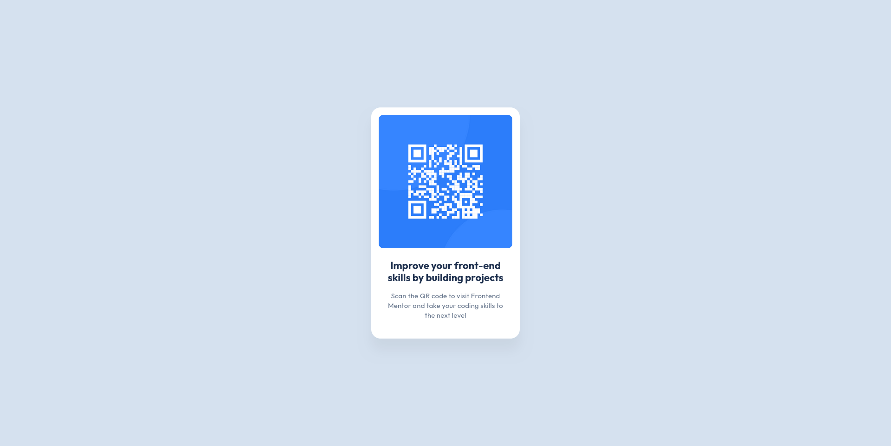

# Frontend Mentor - QR code component solution

This is a solution to the [QR code component challenge on Frontend Mentor](https://www.frontendmentor.io/challenges/qr-code-component-iux_sIO_H). Frontend Mentor challenges help you improve your coding skills by building realistic projects. 

## Table of contents

- [Overview](#overview)
  - [Screenshot](#screenshot)
  - [Built with](#built-with)
  - [Useful resources](#useful-resources)
  - [Author](#author)

## Overview

## Screenshot

## Built with

- HTML5
- CSS
- Google Fonts
- Figma
- [Emacs](https://www.gnu.org/software/emacs/)

## Useful resources

- [What is letter spacing](https://www.figma.com/dictionary/letter-spacing/) - Understand in-depth what is letter spacing in a design

## Author

- LinkedIn - [Jules SAGOT--GENTIL](https://www.linkedin.com/in/jules-sagot/)
